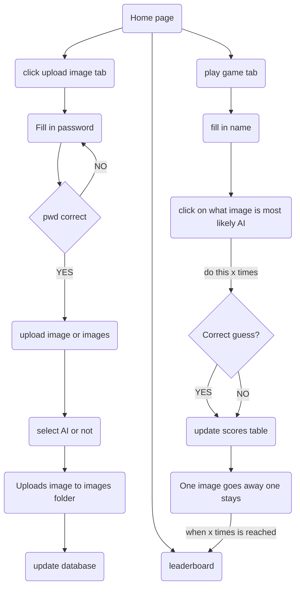

# tinder_streamlit


In this world were it becomes hard to distinguish between real and generated images we have created a Tinder App where people can vote on whether the image is real or generated by an AI.

Welcome to our Tinder Streamlit App! 
This app is a web application built with Streamlit, a Python library for building web applications. It provides a simple and interactive way to explore and interact with images.

## 📦 Repo Structure

```
├── README.md
├── app.py
├── dev.ipynb
├── files
│   ├── mapping.csv
│   └── scores.csv
├── images
│   ├── alice_1.png
│   ├── ...
│   ├── bear_1.png
│   ├── ...
│   ├── dar_1.png
│   ├── ...
│   ├── nathalie_1.png
│   ├── ...
└── requirements.txt
```

## 🚀  Project flow chart:




## 🎮 Setup Instructions

### Step 1: Clone repo
```
git clone git@github.com:bear-revels/tinder_streamlit.git
```

### Step 2: Install dependencies
```
pip install -r requirements.txt
```

### Step 3: Run streamlit app locally
```
streamlit run app.py
```


## 📌 Background

This team project was completed in 5 days as part of the AI Boocamp at BeCode.org. Connect with the team behind the magic.

1. [Bear Revels](https://www.linkedin.com/in/bear-revels/)
2. [Niels Demeyer](https://github.com/niels-demeyer)
3. [Caroline Van Hoeke](https://www.linkedin.com/in/caroline-van-hoeke/)
4. [Nathalie Nachtergaele](https://www.linkedin.com/in/nathalie-nachtergaele/)


> 🙋‍♂️ Special kudos to the initial BANDY team
> * for investigating opensource models
> * for creating the best AI images possible 
> * for laying the foundations of this app/game
>1. [Alice Mendes](https://www.linkedin.com/in/alice-edcm/)
>2. [Bear Revels](https://www.linkedin.com/in/bear-revels/)
>3. [Daryoush Ghanbarpour](https://www.linkedin.com/in/daryoushghanbarpour/)
>4. [Nathalie Nachtergaele](https://www.linkedin.com/in/nathalie-nachtergaele/)
>5. [Yanina Andriienko](https://www.linkedin.com/in/yanina-andriienko-7a2984287/)
